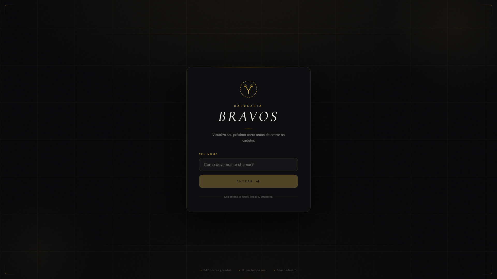
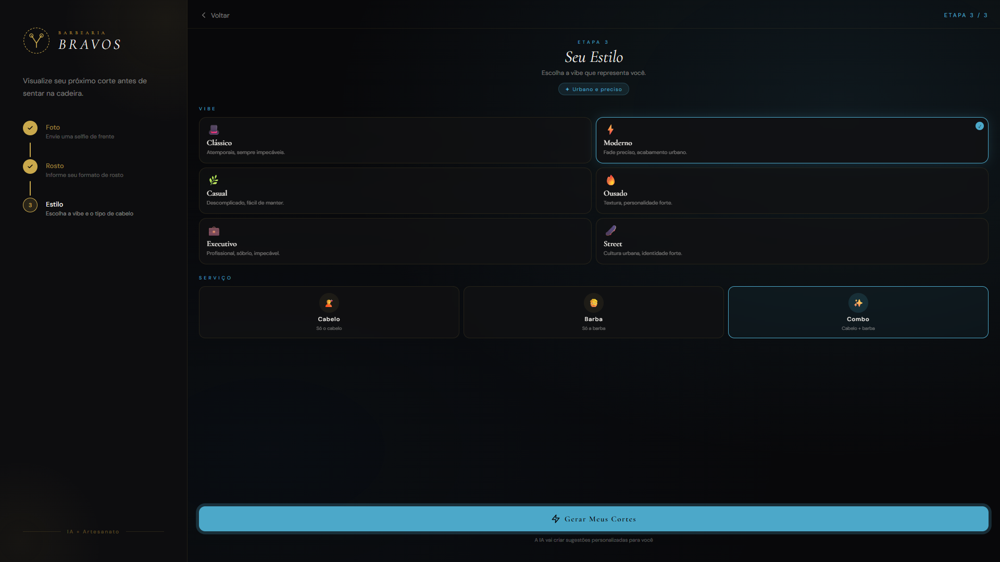
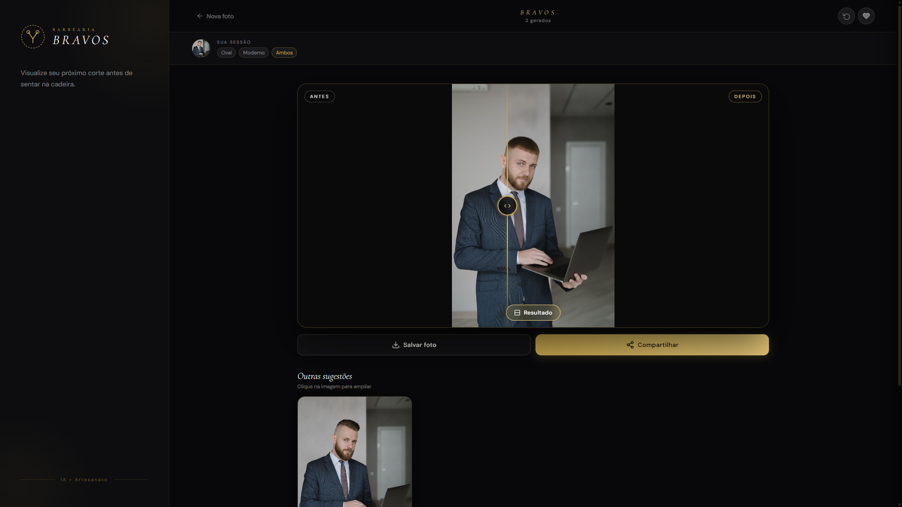

# Bravos Barbearia — AI Hairstyle Visualizer

A full-stack web application that helps barbershop clients explore hairstyle and beard options before an appointment. Users can upload or capture a photo, receive style recommendations based on face shape and lifestyle, and generate AI-powered visual previews while aiming to preserve their facial identity.

> Built as an in-store totem concept and evolved into a virtual visagist experience.

<p align="center">
  
  
  
</p>

## Features

- **AI-powered hairstyle previews** for hair and beard styles.
- **Face-shape and lifestyle recommendations** to help users narrow down style options.
- **Style variations** for users who want a similar but different result.
- **Before-and-after comparison** to make results easier to evaluate.
- **Photo capture and upload** flow for the source image.
- **Favorites** persisted per user through local JSON storage.
- **Request validation and rate limiting** before calls reach the AI provider.
- **Error classification** for temporary provider failures and non-recoverable quota issues.

## Tech Stack

| Area | Technologies |
| --- | --- |
| Frontend | React, Vite, Zustand |
| Backend | Node.js, Express |
| AI integration | Google Gemini image model |
| Persistence | JSON-based local storage |
| Tooling | npm, Git |

## Architecture

```text
React + Vite client
        |
        | image and style data
        v
Express API
(validation, rate limiting, error handling)
        |
        | server-side AI request
        v
Google Gemini image model
        |
        v
Generated hairstyle preview

Local JSON persistence: users and favorites
```

## Quality Engineering

The project applies a QA-oriented mindset at the API boundary. Incoming requests are validated before reaching the AI provider, which helps prevent failures caused by missing photos, invalid image formats, or malformed style data. Rate limiting helps control misuse of the API endpoint and protects the available AI quota.

The backend differentiates between recoverable failures, such as a temporary provider limit, and non-recoverable failures, such as an unavailable quota. This distinction enables the client to show an actionable message instead of a generic error.

The generation prompt includes constraints intended to preserve facial identity, including facial structure, eye color, skin tone, and expression, while changing only hair and beard. Because generative-AI outputs are probabilistic, these constraints are treated as **acceptance criteria to validate**, not as an absolute guarantee.

## Testing Strategy

The project separates deterministic application checks from AI-output evaluation. Deterministic behavior—validation, rate limits, request shape, error mapping, favorites, and UI flows—should be covered by automated tests. AI image quality should be assessed with a documented rubric and controlled test cases, because the same prompt can produce different outputs across model runs.

| Test layer | Scope | Status |
| --- | --- | --- |
| API unit and integration tests | Input validation, provider-error mapping, rate limiting, and response contracts | Planned |
| Frontend component tests | Empty states, upload errors, loading states, and error feedback | Planned |
| End-to-end tests | Upload/capture, style selection, generation request, favorites, and before/after flow | Planned |
| AI behavior validation | Identity preservation and hair/beard-only change evaluated against a documented rubric | Planned |

A detailed, implementation-focused plan is available in [`docs/TEST_STRATEGY.md`](docs/TEST_STRATEGY.md). Update the status table above only after each layer is actually implemented and runnable.

## Getting Started

### Prerequisites

Before running the project, install:

- Node.js (LTS version recommended)
- npm
- A Google Gemini API key

### Installation

```bash
git clone https://github.com/arthurdtz/totem-barbearia.git
cd totem-barbearia
npm install
```

### Environment Setup

Create a `.env` file in the project root:

```env
GEMINI_API_KEY=your_key_here
```

Create an API key through [Google AI Studio](https://aistudio.google.com/app/apikey).

> **Security note:** Never commit `.env`, API keys, personal photos, or real-user records. Keep the API key on the server and ensure `.env` is listed in `.gitignore`. If `db.json` includes real data, keep it private or publish a sanitized `db.example.json` instead.

### Local Development

```bash
npm run dev
```

Open the local URL shown in the terminal.

> If the frontend and Express API are started by different commands in your current `package.json`, document both commands here. Do not keep this section generic if the repository requires two terminals.

## Manual Release Checklist

Before demonstrating or publishing a new version, validate these scenarios:

| Scenario | Expected behavior |
| --- | --- |
| Submit without a photo | The request is blocked and a clear validation message is shown. |
| Upload an unsupported file | The file is rejected safely with an actionable message. |
| Send repeated requests from one IP | The application applies the configured rate limit and communicates whether a retry is appropriate. |
| Simulate a temporary provider limit | The client receives a retry-oriented message instead of a generic error. |
| Simulate an unavailable provider quota | The client identifies the condition as non-recoverable and does not instruct the user to retry indefinitely. |
| Generate a preview | The output is assessed with the AI validation rubric, checking that changes are limited to hair and/or beard as closely as possible. |

## Roadmap

- [ ] Add automated API tests for validation, rate-limit, and provider-error scenarios.
- [ ] Add component and end-to-end tests for the main user flows.
- [ ] Build a small, consented AI-evaluation dataset and record validation results.
- [ ] Add a CI workflow that runs the automated suite on pull requests.
- [ ] Replace JSON persistence with a production-ready database.
- [ ] Publish a live demo.

## Contributors

Bravos Barbearia was developed collaboratively as a full-stack project. The responsibilities below describe each contributor's primary focus while recognizing shared work across the application.

| Contributor | Primary focus | Links |
| --- | --- | --- |
| **Arthur Meneses** | Full-stack development with a quality-oriented focus: requirements analysis, feature definition, user-centered flows, and reliability considerations such as validation, error handling, and expected user behavior. | [GitHub](https://github.com/arthurdtz) · [LinkedIn](https://www.linkedin.com/in/arthurdtz/) |
| **Ryan Alves** | Full-stack development with a data-oriented focus: initial product concept, data modeling, and persistence/database-related decisions. | [GitHub](https://github.com/ryan-alvess) · [LinkedIn](https://www.linkedin.com/in/ryan-alves-7092a9324/) |

## License

This project is licensed under the MIT License. See the [LICENSE](LICENSE) file for details.

## Acknowledgments

- [Google Gemini](https://ai.google.dev/) for the AI capabilities used by the project.